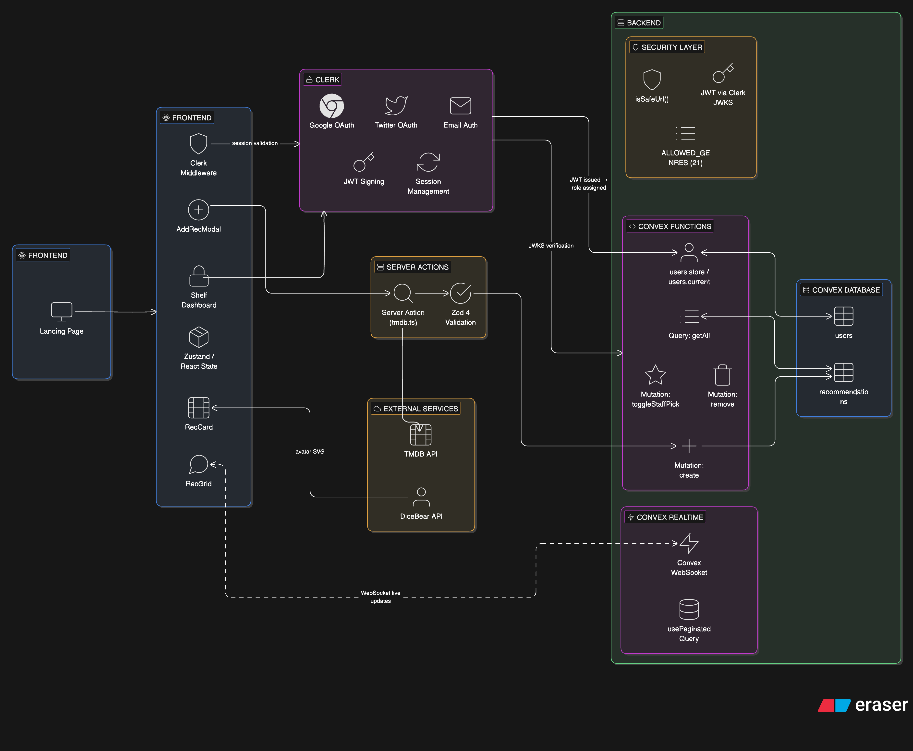

# HypeShelf

**Collect and share the movies you're hyped about.**

A community-driven movie recommendations platform where users drop their favorite films on a shared shelf. 


---

## Features

- **TMDB Movie Search** — Search TMDB to auto-fill title, poster, genre, and year in 2 clicks
- **Hype Rating System** — 0.5-precision star rating (1–5 stars) mapped to a 1–10 internal hype score
- **Real-time Collaborative Shelf** — Convex WebSocket subscriptions push every change to all clients instantly
- **Full CRUD** — Create, edit, and delete recommendations. Users manage their own; admins manage all
- **Staff Picks Curation** — Admins mark standout recs with a gold Staff Pick badge
- **Role-Based Access Control** — Admin/User roles via server-side email allowlist with zero UI attack surface
- **Genre Filtering** — 21 filterable genres (7 primary + 14 extended from TMDB) with animated pill UI
- **Infinite Scroll** — IntersectionObserver triggers automatic page loads with cursor-based pagination
- **Defense-in-Depth Validation** — Zod schemas on client + independent Convex runtime checks on server
- **Clerk Authentication** — Email + Google + X OAuth with fully custom sign-in/sign-up pages
- **DiceBear Avatar Generation** — Notionists-style unique avatars from username seeds
- **Motion Animations** — Framer Motion card transitions, hero animations, animated filter pills
- **XSS-Safe URL Handling** — `link` and `posterUrl` validated against `javascript:` injection on both layers
- **Manual Entry Fallback** — Movies not in TMDB can be added with fully manual fields
- **Responsive Grid Layout** — Mobile-first 1→2→3→4 column grid with adaptive header

---

## Tech Stack

| Layer | Technology | Why |
|---|---|---|
| **Framework** | Next.js 16 (App Router, Turbopack) | Server Components + Server Actions for TMDB |
| **Language** | TypeScript (strict) | End-to-end type safety from schema to UI |
| **Auth** | Clerk (`@clerk/nextjs`) | Email + OAuth + JWT + custom pages |
| **Backend + DB** | Convex | Real-time BaaS with WebSocket subscriptions |
| **Validation** | Zod 4 + Convex runtime | Defense-in-depth — neither layer trusts the other |
| **Styling** | Tailwind CSS v4 + shadcn/ui | Utility-first + accessible Radix primitives |
| **Animations** | motion/react (Framer Motion) | Declarative animations for cards, filters, hero |
| **Movie Data** | TMDB API via Server Action | Real metadata without exposing API key |
| **Avatars** | DiceBear (Notionists) | Unique generated avatars from username seeds |
| **Forms** | react-hook-form + @hookform/resolvers | Performant forms with Zod schema integration |

---

## Architecture



> Full architecture details, data flow patterns, and service dependencies: **[docs/ARCHITECTURE.md](./docs/ARCHITECTURE.md)**

---

## Getting Started

### Prerequisites

| Requirement | Version | Purpose |
|---|---|---|
| **Node.js** | 18+ | JavaScript runtime |
| **pnpm** | Latest | Package manager (project uses pnpm workspaces) |
| **Clerk account** | Free tier | Authentication provider — [clerk.com](https://clerk.com) |
| **Convex account** | Free tier | Backend-as-a-Service — [convex.dev](https://convex.dev) |
| **TMDB API key** | Free | Movie metadata — [developer.themoviedb.org](https://developer.themoviedb.org/docs/getting-started) |

### 1. Clone and Install

```bash
git clone https://github.com/PranitPatil03/hypeshelf.git
cd hypeshelf
pnpm install
```

### 2. Environment Variables

Create `.env.local` in the project root:

```env
NEXT_PUBLIC_CONVEX_URL=<your-convex-deployment-url>

NEXT_PUBLIC_CLERK_PUBLISHABLE_KEY=<your-clerk-publishable-key>

CLERK_SECRET_KEY=<your-clerk-secret-key>

TMDB_API_KEY=<your-tmdb-api-key>
```

**Where to find each value:**

| Variable | Where to get it |
|---|---|
| `CLERK_SECRET_KEY` | Clerk Dashboard → API Keys → Secret key |
| `TMDB_API_KEY` | TMDB → Settings → API → API Key (v3 auth) |
| `NEXT_PUBLIC_CLERK_PUBLISHABLE_KEY` | Clerk Dashboard → API Keys → Publishable key |
| `NEXT_PUBLIC_CONVEX_URL` | Convex Dashboard → Settings → Deployment URL (created after first `npx convex dev`) |

### 3. Set Up Convex

Start the Convex development server (deploys schema + functions):

```bash
npx convex dev
```

Set admin email(s) so your account gets the `admin` role on login (comma-separated for multiple admins):

```bash
npx convex env set ADMIN_EMAILS "your-email@example.com,another-admin@example.com" --prod
```

**Note:** Only users whose email is listed in `ADMIN_EMAILS` will be assigned the admin role. Admins are required for seeding and privileged actions.

Set the Clerk JWT issuer domain (required for Convex to verify Clerk tokens):

```bash
npx convex env set CLERK_JWT_ISSUER_DOMAIN "https://<your-clerk-domain>.clerk.accounts.dev"
```

### 4. Configure Clerk

1. Go to [clerk.com](https://clerk.com) and create a new application
2. **Enable sign-in methods:** Email/Password, Google OAuth, X (Twitter) OAuth
3. **Create JWT template for Convex:**
   - Clerk Dashboard → JWT Templates → New Template → Select "Convex"
   - Name it `convex`
   - Copy the **Issuer** URL — this is your `CLERK_JWT_ISSUER_DOMAIN`
4. **Verify** `convex/auth.config.ts` matches your Clerk issuer domain

### 5. Seed the Database (Optional)

**Seeding is admin-only:**

Populate the database with ~220 movie recommendations across all 21 genres (must be logged in as admin):

```bash
npx tsx scripts/seed.ts
```

If you need to clear the recommendations table for testing, run:

```bash
npx convex function call recommendations:clearAll
```

This fetches real movie data from TMDB, generates random user names, and inserts ~220 recs with real poster images. Only admins (emails in `ADMIN_EMAILS`) can seed.

### 6. Run the Dev Server

```bash
pnpm dev
```

Open [http://localhost:3000](http://localhost:3000).

| Page | URL | Access |
|---|---|---|
| Landing page | `/` | Public — hero section + limited recommendation grid |
| Shelf dashboard | `/shelf` | Protected — full grid with filters, infinite scroll, add/edit/delete |
| Sign in | `/sign-in` | Public — custom Clerk sign-in page |
| Sign up | `/sign-up` | Public — custom Clerk sign-up page |

### Verify Everything Works

1. **Landing page loads** — hero section and recommendation cards (if seeded)
2. **Sign up** — create an account, redirected to `/shelf`
3. **Admin role** — if your email matches `ADMIN_EMAILS`, you see Staff Pick toggle and delete on all cards
4. **Add a rec** — click "+ add your recs", search TMDB, submit
5. **Real-time** — open two tabs at `/shelf`, add a rec in one — it appears in the other instantly
---

## Project Structure

```
hypeshelf/
│
├── app/                                  # Next.js 16 App Router pages
│   ├── layout.tsx                        # Root layout — ConvexClientProvider wrapping
│   │                                     #   (ClerkProvider + ConvexProvider + Sonner toasts)
│   ├── page.tsx                          # Public landing page — Hero + RecGrid
│   ├── globals.css                       # Tailwind CSS v4 imports + custom CSS variables
│   │
│   ├── shelf/
│   │   └── page.tsx                      # Protected dashboard — full RecGrid with
│   │                                     #   filters, infinite scroll, add/edit/delete
│   │
│   ├── sign-in/[[...sign-in]]/
│   │   └── page.tsx                      # Custom Clerk sign-in (branded UI, OAuth)
│   │
│   ├── sign-up/[[...sign-up]]/
│   │   └── page.tsx                      # Custom Clerk sign-up (full name + OAuth)
│   │
│   ├── sso-callback/
│   │   └── page.tsx                      # OAuth redirect handler
│   │
│   └── actions/
│       └── tmdb.ts                       # Server Action ('use server') — TMDB search
│                                         #   API key never reaches client
│
├── components/                           # React components
│   ├── header.tsx                        # Auth-aware navbar, mobile hamburger
│   ├── hero.tsx                          # Animated landing hero (motion/react)
│   ├── rec-grid.tsx                      # Infinite scroll grid (usePaginatedQuery)
│   ├── rec-card.tsx                      # Card: poster, stars, badges, edit/delete
│   ├── filter-bar.tsx                    # Animated genre pills + Staff Picks + My Recs
│   ├── add-rec-modal.tsx                 # 2-step: TMDB search → Zod-validated form
│   ├── convex-client-provider.tsx        # ClerkProvider + ConvexProvider + users.store
│   │
│   ├── ui/                               # shadcn/ui primitives
│   │   ├── button.tsx                    # Variants: default, destructive, outline, ghost
│   │   ├── dialog.tsx                    # Modal (Radix UI)
│   │   ├── form.tsx                      # react-hook-form integration
│   │   ├── input.tsx, label.tsx          # Form inputs
│   │   ├── select.tsx                    # Dropdown select
│   │   ├── slider.tsx                    # Range slider
│   │   ├── sonner.tsx                    # Toast notifications
│   │   └── textarea.tsx                  # Multi-line text input
│   │
│   ├── shared/                           # Custom shared components
│   │   ├── movie-rating-stars.tsx        # Read-only half-star SVG display
│   │   ├── movie-search.tsx              # TMDB movie search with debounce
│   │   ├── star-rating-input.tsx         # Half-star precision rating input
│   │   ├── profile-dropdown.tsx          # User profile dropdown with admin badge
│   │   └── rec-author-badge.tsx          # Author avatar + name (DiceBear fallback)
│   │
│   └── animate-ui/                       # Motion-animated icons
│       ├── icons/                        # activity, axe, badge-check, clapperboard,
│       │                                 #   compass, heart, moon-star, orbit,
│       │                                 #   party-popper, sparkles, star
│       └── primitives/animate/slot.tsx   # Animation slot primitive
│
├── convex/                               # Convex backend
│   ├── schema.ts                         # DB schema — recommendations (10 fields,
│   │                                     #   3 indexes) + users (4 fields, 1 index)
│   ├── recommendations.ts               # CRUD + RBAC mutations + paginated query
│   ├── users.ts                          # Upsert on login + role from ADMIN_EMAILS
│   ├── auth.config.ts                    # Clerk JWT issuer configuration
│   ├── seed.ts                           # Bulk insert mutation for seeding (admin-only)
│   ├── lib/
│   │   └── admin.ts                      # Shared admin utilities (isAdminEmail)
│   └── _generated/                       # Auto-generated typed API (do not edit)
│
├── lib/                                  # Shared utilities
│   ├── constants.ts                      # MOVIE_GENRES array (7 primary genres)
│   ├── validation.ts                     # Zod schemas + ALLOWED_GENRES (21 total)
│   └── utils.ts                          # cn() — clsx + tailwind-merge
│
├── hooks/
│   └── use-is-in-view.tsx                # IntersectionObserver hook (infinite scroll)
│
├── docs/                                 # Extended documentation
│   ├── ARCHITECTURE.md                   # System diagram, data flow patterns
│   ├── BACKEND.md                        # Schema, Convex functions, TMDB integration
│   ├── SECURITY.md                       # Auth layers, RBAC, validation, XSS
│   ├── API.md                            # Full API reference
│   ├── COMPONENTS.md                     # UI component reference
│   ├── DESIGN_DECISIONS.md               # 8 architectural decisions with reasoning
│   ├── GETTING_STARTED.md                # Extended setup guide
│   ├── PROJECT_STRUCTURE.md              # Full annotated tree
│   └── image.png                         # Architecture diagram
│
├── scripts/seed.ts                       # CLI: fetch TMDB data + insert ~220 recs
├── proxy.ts                              # Clerk middleware (route protection)
├── next.config.ts                        # Next.js configuration
├── tsconfig.json                         # TypeScript (strict)
├── postcss.config.mjs                    # PostCSS + Tailwind CSS v4
├── eslint.config.mjs                     # ESLint configuration
├── components.json                       # shadcn/ui configuration
└── package.json                          # Dependencies and scripts
```

---

## Security & Privacy

🔐 **Three-Layer Authentication** — Clerk middleware blocks unauthenticated requests at the edge, each protected page independently verifies auth state, and every Convex mutation re-verifies the JWT against Clerk's JWKS endpoint. No single layer is the boundary.

🛡️ **Server-Side RBAC** — Roles are assigned from a server-only `ADMIN_EMAILS` env var and stored in the database. Every mutation reads the role from the DB — never from client state, headers, or cookies. Privilege escalation from the client is structurally impossible.

✅ **Dual Input Validation** — Zod validates on the client for instant UX feedback. Convex mutations validate independently on the server as the security boundary. Bypassing the React form still hits full server-side checks.

🔒 **XSS Prevention** — React JSX auto-escapes all output. `isSafeUrl()` blocks `javascript:`, `data:`, and `vbscript:` URL schemes on both layers. Zero uses of `dangerouslySetInnerHTML`. External links use `rel="noopener noreferrer"`.

🔑 **Transport & API Key Security** — All communication over TLS (WSS for Convex, HTTPS for Clerk/TMDB). TMDB API key is server-only via Server Action (`'use server'`). No secrets reach the client.

🚫 **CSRF Protection** — Zero HTML form submissions. All mutations go through Convex's authenticated WebSocket — CSRF is structurally impossible.

📄 **Pagination Cap** — Server enforces `MAX_PAGE_SIZE = 100` on all queries, preventing data exfiltration via oversized page requests.

> Full details — auth layers, RBAC matrix, validation rules, XSS prevention, API key protection, and more: **[docs/SECURITY.md](./docs/SECURITY.md)**

---

## Documentation

| Document | What's Inside |
|---|---|
| [**Getting Started**](./docs/GETTING_STARTED.md) | Extended setup guide with prerequisites, env vars, Clerk/Convex setup, seeding, troubleshooting |
| [**Architecture**](./docs/ARCHITECTURE.md) | System diagram, 6 data flow patterns, real-time model, service dependencies |
| [**Backend**](./docs/BACKEND.md) | Database schema, Convex functions, pagination, TMDB integration, seed data |
| [**Security**](./docs/SECURITY.md) | Full security documentation — auth layers, RBAC, validation, XSS prevention |
| [**API Reference**](./docs/API.md) | Every query/mutation — args, returns, auth, authorization logic |
| [**Components**](./docs/COMPONENTS.md) | UI component reference — props, behavior, composition |
| [**Design Decisions**](./docs/DESIGN_DECISIONS.md) | 8 architectural decisions with reasoning and trade-offs |
| [**Project Structure**](./docs/PROJECT_STRUCTURE.md) | Full annotated directory tree with detailed file descriptions |
